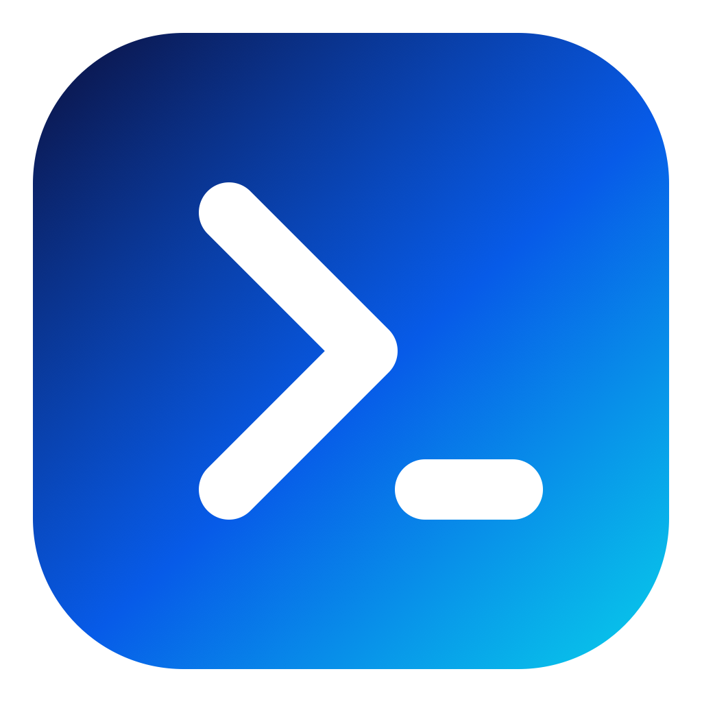

# Script Launcher

<p align="center">
  
</p>

<p align="center"><strong>把终端里重复输入的命令，变成一次点击。</strong><br />A lightweight, local-first desktop launcher for scripts and commands.</p>

<p align="center">
  <a href="https://github.com/lemon-codehub/ScriptLauncher/actions/workflows/ci.yml"></a>
  <a href="LICENSE"></a>
  
</p>

[产品介绍与下载](https://lemontree.one/script_launcher/) · [GitHub Releases](https://github.com/lemon-codehub/ScriptLauncher/releases) · [问题反馈](https://github.com/lemon-codehub/ScriptLauncher/issues)

## 为什么做这个工具？

启动开发服务、构建项目、部署应用、备份数据库……这些命令常常散落在终端历史和不同目录中。Script Launcher 将它们整理成可搜索、可分组的入口，保留现有脚本，一键运行并实时查看输出。

无需账户，入口、分组和设置保存在本地 SQLite 数据库。脚本使用你电脑已有的解释器和开发环境。

## 功能

- **分组与入口管理**：新增、编辑、删除、拖拽排序，以及跨分组移动。
- **一键执行**：Shell、Python、Node.js、PowerShell、Batch、EXE、macOS App 和 PATH 中的命令。
- **实时执行日志**：底部固定日志面板，可拖动调整高度、切换任务、清空显示。
- **终止运行**：后台任务运行期间可终止其进程组；结束后显示“已终止”，日志保留。
- **常用入口优先**：点击统计、使用频率排序、名称/路径/参数搜索。
- **自定义图标**：可搜索的 Lucide 图标、Emoji 选择器和自定义图片。
- **配置与外观**：工作目录、启动参数、系统终端模式，以及浅色/深色/跟随系统主题。
- **本地工具整合**：从入口菜单在文件管理器中打开对应位置。

> `main` 分支可能包含尚未发版的功能，安装包功能以对应 Release 为准。

## 下载与安装

在[介绍页](https://lemontree.one/script_launcher/)或 [Releases](https://github.com/lemon-codehub/ScriptLauncher/releases) 选择与你电脑匹配的包：

| 系统 | 下载架构 | 产物 |
| --- | --- | --- |
| macOS，Apple Silicon（M 系列） | arm64 | DMG / ZIP |
| macOS，Intel | amd64（即 x86_64） | DMG / ZIP |
| Windows 10 / 11，64 位 | amd64（即 x64） | EXE / 便携 ZIP |

macOS 打开 DMG 后，将 `Script Launcher.app` 拖入“应用程序”。Windows 可解压便携 ZIP 后运行 EXE；需要 Microsoft Edge WebView2 Runtime。

当前自动构建的 macOS 包使用 ad-hoc 签名，未经 Apple 公证；Windows 包也没有 Authenticode 签名，系统可能显示安全提示。请核对下载来源和 SHA-256，只运行你信任的程序；不要全局关闭系统安全机制。

## 使用方法

1. 创建分组，例如“开发”“服务器”“日常工具”。
2. 新增入口，选择脚本或程序，按需填写工作目录和参数。
3. 点击卡片运行，在底部查看 stdout、stderr、退出码和耗时。
4. 要结束后台任务，选择对应执行日志，点击右侧的 **终止**。

### 执行行为与边界

- Python、Node.js、PowerShell 等解释器需自行安装，并能通过 PATH 找到。
- 参数按命令行参数解析，含空格的单个参数请加引号；管道、重定向等逻辑建议放入脚本。
- 支持的 Unix 脚本优先使用 shebang；macOS 会补充用户交互式 Shell 的 PATH。
- 未指定工作目录时，本地脚本使用脚本所在目录；PATH 命令继承应用工作目录。
- **在终端中显示**：任务交给系统终端后即返回，此时“成功”只表示启动成功。后续输出和停止操作请在终端处理，应用内的“终止”不适用于此模式。
- macOS App 通过系统 `open` 启动，状态表示启动请求结果，不跟踪 GUI 应用的整个生命周期。
- 后台终止针对当前进程组（Windows 为进程树）；自行脱离进程组或交给其他服务管理的任务不保证能被结束。
- 前端每个入口保留最近约 200 KiB 日志文本；后端结果摘要保留最近 12 KiB。日志不是持久化审计记录。
- 脚本拥有当前用户的权限，应用不提供脚本沙箱。请勿运行不可信的脚本或命令。

## 本地开发

技术栈：Wails v3 · Go · SQLite · React · TypeScript · Vite · React Router · Tailwind CSS · Radix/shadcn 风格组件 · Lucide · Zustand。

### 环境要求

- Go 1.25+，具体版本参见 `go.mod`。
- Node.js 24 LTS、pnpm 11.9.0。
- Wails CLI **v3.0.0-alpha2.117**，与 `go.mod` 和前端运行时保持一致。
- macOS 需要 Xcode Command Line Tools；Windows 需要 WebView2。
- DMG 打包必须在 macOS 上执行。仓库中的移动端/Linux 构建文件来自 Wails 模板，当前发行目标仅为 macOS 与 Windows。

```bash
git clone https://github.com/lemon-codehub/ScriptLauncher.git
cd ScriptLauncher

npm install --global pnpm@11.9.0
go install github.com/wailsapp/wails/v3/cmd/wails3@v3.0.0-alpha2.117

pnpm --dir frontend install --frozen-lockfile
pnpm --dir frontend build
wails3 dev
```

请将 Go 的 bin 目录加入 PATH。项目保留了嵌入资源占位文件，首次克隆可正常解析 Go 包；运行应用前仍需构建真实前端资源。Wails v3 仍为预发布版本，不建议单独将 CLI 更新到 `latest`。

### 检查与构建

```bash
pnpm --dir frontend build
go test ./...
go vet ./...

# 修改导出的 Go 服务或模型后，重新生成 TypeScript 绑定
wails3 generate bindings -clean=true -ts -i

# 构建本机程序
wails3 task build

# macOS .app 打包
wails3 task darwin:package
```

`frontend/bindings/` 为生成代码，不要手工修改。修改 Go 接口后应同时提交更新后的绑定。

## 本地发版

macOS 上可以一条命令打包三个发行架构：

```bash
./scripts/package-release.sh 0.0.2 --no-installer

# 只生成一个 macOS 架构
./scripts/package-release.sh 0.0.2 --target mac --mac-arch arm64

# 合并为可选的 Universal 包（默认是分架构包）
./scripts/package-release.sh 0.0.2 --target mac --mac-arch universal

# Windows 便携版；在 macOS 上使用 Go 交叉编译
./scripts/package-release.sh 0.0.2 --target windows --no-installer
```

产物位于 `release/v0.0.2/`，包含版本化文件名、许可证文件（DMG/ZIP 内）与 `SHA256SUMS.txt`。脚本自动安装锁定的前端依赖、构建、测试并恢复临时修改的版本元数据。`--skip-tests` 仅跳过 Go 测试和静态检查，前端仍会构建。

本地额外安装 NSIS 后，可使用 `--installer` 生成 Windows 安装器；GitHub Actions 默认只生成 EXE 与便携 ZIP，不依赖签名密钥或 NSIS。

校验下载文件：

```bash
cd release/v0.0.2
shasum -a 256 -c SHA256SUMS.txt
```

## GitHub Actions

仓库包含两个工作流，第三方 Action 固定到提交 SHA：

- **CI**：推送 `main` 或提交 PR 时，构建前端、运行 Go 测试和静态检查，并验证 Windows x64 交叉编译。
- **Package Release**：在 macOS runner 上分别构建 Mac arm64、Mac x86_64、Windows x64；合并校验文件后上传可下载的 workflow artifact。

### 手动打包

在 **Actions → Package Release → Run workflow** 填入版本号（如 `0.0.2`），也可以使用 GitHub CLI：

```bash
gh workflow run release.yml --ref main -f version=0.0.2
gh run list --workflow release.yml
gh run watch <run-id>
gh run download <run-id> -n ScriptLauncher-v0.0.2 -D release/v0.0.2
```

手动运行只生成构建产物，不会创建标签或公开发布新版本。

### 创建 Release 草稿

```bash
git tag v0.0.2
git push origin v0.0.2
```

推送符合 `vX.Y.Z` 的标签会触发同一打包流程，并将产物上传至对应的 **Draft Release**。确认测试与版本说明后，再在 GitHub 发布草稿。版本号不可包含额外 Shell 字符。

## 数据位置

数据库名为 `scriptlauncher.db`：

- macOS：`~/Library/Application Support/ScriptLauncher/`
- Windows：`%AppData%\ScriptLauncher\`
- Linux（开发支持）：`~/.config/ScriptLauncher/`

可用 `SCRIPT_LAUNCHER_DATA_DIR` 指定独立数据目录。备份时建议先退出应用，再复制整个目录。卸载/替换应用程序前请按需备份数据。

## 项目结构

```text
.
├── main.go / launcher_service.go    # Wails 入口与后端服务
├── database.go / models.go          # SQLite 与数据模型
├── executor.go / process_*.go       # 执行、日志、终止进程
├── frontend/src/                   # React 界面与 Zustand 状态
├── frontend/bindings/               # 自动生成的 Go/TypeScript 绑定
├── build/                          # Wails 平台资源和构建任务
├── scripts/package-release.sh      # 可复用的本地打包脚本
└── .github/workflows/              # CI 与 GitHub Actions 打包
```

网站源码、服务器部署脚本、个人配置、数据库、构建产物和凭据不属于公开仓库。

## 参与贡献

欢迎提交问题、建议和 Pull Request。开始前请阅读 [CONTRIBUTING.md](CONTRIBUTING.md)。安全问题请按 [SECURITY.md](SECURITY.md) 私密报告，不要把本地日志中的凭据或个人路径直接公开。

## 许可证与致谢

项目采用 [MIT License](LICENSE)。第三方依赖和字体保留各自许可证，详见 [THIRD_PARTY_NOTICES.md](THIRD_PARTY_NOTICES.md)。

感谢 Wails 和各开源项目提供的基础能力。
